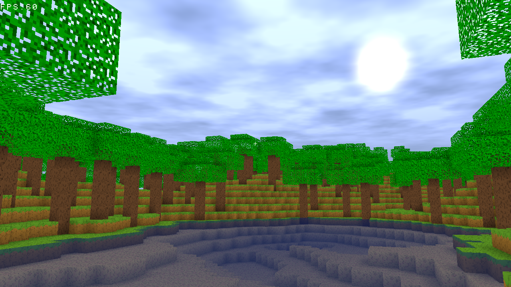

# Mineclone


Minecraft clone from scratch

Work in progress

# TODO List
- [x] Chunk Rendering
- [x] AABB Collision
- [ ] Terrain Generation
- [ ] Chunk Loading/Saving
- [ ] Optimizations
- [ ] Lighting
- [ ] Multiplayer
- [ ] CI/CD

# Bugs
- [ ] floating point precision error in collision detection

# Requirements
- gcc (C++17)
- cmake
- Ninja
- glew
- SDL2

# Third Party Libraries
- GLM
- FastNoise
- stb
- imgui
- enet

# Build
```bash
cmake -B build -G Ninja
cmake --build build
```