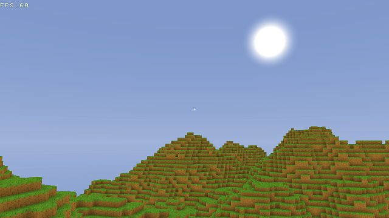

# Mineclone

Minecraft clone from scratch
Work in progress

# TODO List
- [x] Chunk Rendering
- [x] AABB Collision
- [ ] Terrain Generation
- [ ] Lighting
- [ ] Multiplayer
- [ ] CI/CD

# Bug List
- [ ] Collision is not working properly (floating point precision error)

# Requirements
- gcc (C++17)
- cmake
- glew
- SDL2
- GLM

- FastNoise
- stb
- imgui

# Build
cmake -B build -G Ninja
cmake --build build
